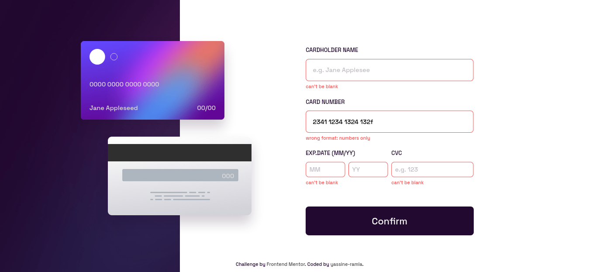

# Frontend Mentor - Interactive card details form solution

This is a solution to the [Interactive card details form challenge on Frontend Mentor](https://www.frontendmentor.io/challenges/interactive-card-details-form-XpS8cKZDWw). Frontend Mentor challenges help you improve your coding skills by building realistic projects.

## Table of contents

- [Overview](#overview)
  - [The challenge](#the-challenge)
  - [Screenshot](#screenshot)
  - [Links](#links)
- [My process](#my-process)
  - [Built with](#built-with)
  - [What I learned](#what-i-learned)
  - [Continued development](#continued-development)
- [Author](#author)

## Overview

### The challenge

Users should be able to:

- Fill in the form and see the card details update in real-time
- Receive error messages when the form is submitted if:
  - Any input field is empty
  - The card number, expiry date, or CVC fields are in the wrong format
- View the optimal layout depending on their device's screen size
- See hover, active, and focus states for interactive elements on the page

### Screenshot





### Links

- Solution URL: [solution URL](https://www.frontendmentor.io/solutions/the-absolute-position-was-so-helpfull-for-this-challenge-DMS2sqtL5o)
- Live Site URL: [live site URL](https://yassine-ramla.github.io/Frontend-Mentor_Interactive-card-details-form-solution/)

## My process

### Built with

- Semantic HTML5 markup
- Flexbox
- CSS Grid
- Mobile-first workflow

### What I learned

what i've learnt from this challenge is when to use the absolute position and how much is it useful, for exmple

```html
<div class="card-back">
  <span id="cvc">000</span>
  
</div>
```

```css
#cvc {
  width: 76%;
  height: 20%;
  font-size: 0.75rem;
  display: flex;
  align-items: center;
  justify-content: flex-end;
  position: absolute;
  top: calc(40%);
  right: 12%;
  color: hsl(270, 3%, 87%);
}
```
and that will position the cvc span exatly on the position of the cvc in the image.

### Continued development

there still some screen sizes that i didn't see the look of the website on them and maybe some dementions needs to be fixed.

## Author

- Frontend Mentor - [@yassine-ramla](https://www.frontendmentor.io/profile/yassine-ramla)